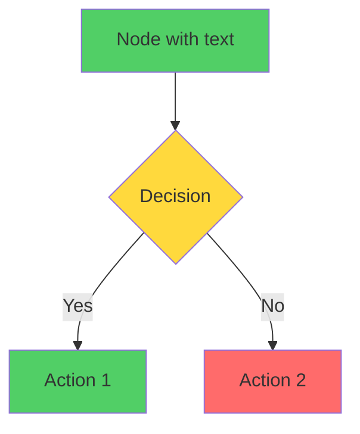

# 🎨 POS App Flowchart Diagrams - Complete Guide

## Overview

Your Flutter POS application now has **comprehensive visual flowcharts** documenting the entire system architecture, covering all 15+ modules, user flows, data interactions, and system processes.

✅ **All 16 diagrams generated** in both SVG (scalable) and PDF (printable) formats  
✅ **Interactive HTML viewer** for easy browsing and sharing  
✅ **Production-ready** documentation suitable for teams, presentations, and onboarding

---

## 📊 Diagram Inventory

### Generated Diagrams

| # | Diagram Name | Purpose | Audience |
|---|---|---|---|
| 1️⃣ | Application Lifecycle | System initialization, boot sequence | Developers |
| 2️⃣ | Authentication System | Login flows, session management | Developers, Security |
| 3️⃣ | Role-Based Access | User roles, permissions | Developers, Architects |
| 4️⃣ | Main Navigation | Tab navigation, module access | Developers, UX |
| 5️⃣ | Orders Module | Order CRUD, payment, sync | Developers, PMs |
| 6️⃣ | Tables & Reservations | Floor view, bookings, occupancy | Developers, Operations |
| 7️⃣ | Inventory Management | Stock tracking, suppliers | Developers, Operations |
| 8️⃣ | Menu Management | Menu CRUD, offline sync | Developers |
| 9️⃣ | Offline-First Architecture | SQLite, sync queue, conflict resolution | Architects, Developers |
| 🔟 | Analytics & Reporting | Revenue analytics, exports | Developers, Business |
| 🔟➕ | Employee Management | Staff lifecycle, roles, performance | Developers, HR |
| 🔟➖ | Error Handling | Error types, recovery, retry logic | Developers, QA |
| 🔟✖️ | Notification System | Order alerts, reservations, stock | Developers, UX |
| 🔟⊕ | State Management | Provider architecture, caching | Developers, Architects |
| 🔟⭕ | Complete Data Flow | End-to-end from UI to sync | Developers, Architects |
| 🔟❤️ | System Integrations | Firebase, Supabase, external services | Architects |

---

## 🚀 Quick Start

### Option 1: View in Browser (Recommended)

```powershell
# Windows (PowerShell)
start diagrams\index.html

# macOS
open diagrams/index.html

# Linux
xdg-open diagrams/index.html
```

### Option 2: View Individual Diagrams

All diagrams are in `./diagrams/` folder:
- **SVG files** (scalable, interactive in browser): `flowchart-#.svg`
- **PDF files** (printable, shareable): `flowchart-#.pdf`
- **HTML index** (organized viewer): `index.html`

### Option 3: Regenerate Anytime

```powershell
# Regenerate diagrams after updating flowchart.md
npm run generate

# Or rebuild from scratch
npm run rebuild

# Watch for changes (auto-regenerate)
npm run generate:watch
```

---

## 📁 Project Structure

```
pos_app/
├── flowchart.md                    ← Main diagram definitions (Mermaid)
├── diagrams/                       ← Generated diagrams
│   ├── index.html                  ← Beautiful HTML viewer
│   ├── flowchart-1.svg             ← SVG diagram 1
│   ├── flowchart-1.pdf             ← PDF diagram 1
│   ├── flowchart-2.svg             ← SVG diagram 2
│   ├── ... (all 16 diagrams)
│
├── generate-diagrams.js            ← Node.js generator
├── generate-diagrams.bat           ← Windows batch script
├── generate-diagrams.sh            ← Linux/macOS bash script
├── package.json                    ← NPM scripts
└── .github/workflows/
    └── generate-diagrams.yml       ← CI/CD automation

```

---

## 💻 NPM Commands

```bash
# Generate diagrams
npm run generate

# Watch mode - auto-regenerate on changes
npm run generate:watch

# Clean and rebuild
npm run rebuild

# Serve diagrams locally (Python HTTP server)
npm run serve

# Complete docs: generate + serve
npm run docs
```

---

## 🔄 Automated Generation (CI/CD)

### GitHub Actions Workflow

Diagrams automatically regenerate when:
- ✅ `flowchart.md` is modified
- ✅ `generate-diagrams.js` is updated
- ✅ Manually triggered via GitHub Actions UI

**File**: `.github/workflows/generate-diagrams.yml`

Features:
- Runs on `main` and `develop` branches
- Generates SVG + PDF formats
- Commits changes automatically
- Creates release artifacts
- Optional GitHub Pages deployment

### Enable GitHub Pages (Optional)

1. Go to repository Settings → Pages
2. Set source to: `gh-pages` branch
3. Diagrams will be published at: `https://yourorg.github.io/pos_app/diagrams/`

---

## 📝 Diagram Naming Convention

### File Naming
```
flowchart-{number}.{format}

Examples:
- flowchart-1.svg    (Application Lifecycle)
- flowchart-5.pdf    (Orders Module)
- flowchart-9.svg    (Offline Architecture)
```

### Section Structure in `flowchart.md`
```markdown
## {Number}. {Title}

\`\`\`mermaid
graph TD
    ... diagram code ...
end
\`\`\`

---
```

---

## 🛠️ Customizing Diagrams

### Edit Diagrams

1. Open `flowchart.md` in any text editor
2. Find the section to modify (e.g., "## 5. Orders Module")
3. Edit the Mermaid code block
4. Save file
5. Run `npm run generate` to create updated diagrams

### Mermaid Syntax Tips



**Common Shapes:**
- `["text"]` - Rectangle
- `{text}` - Diamond (decision)
- `(text)` - Rounded rectangle
- `[[text]]` - Subroutine
- `[(text)]` - Cylinder

**Styling:**
- `style NodeId fill:#color`
- Colors: `#51CF66` (green), `#FFD93D` (yellow), `#FF6B6B` (red), `#339AF0` (blue)

---

## 🎓 Usage Scenarios

### 👨‍💻 For Developers
- **Onboarding**: New team members understand system architecture
- **Development Reference**: Check flows before implementing features
- **Code Review**: Compare code changes against documented flows
- **Debugging**: Follow error handling and data flow paths

**Quick Links**: Sections 1, 4, 5, 6, 7, 8, 9, 14, 15

### 👨‍⚔️ For Architects
- **System Design**: Review overall architecture and integrations
- **Scalability**: Plan improvements based on current flow
- **Technology Decisions**: Evaluate offline-first and sync strategies
- **Documentation**: Create RFCs and design documents

**Quick Links**: Sections 9, 14, 16

### 📊 For Product Managers
- **Feature Understanding**: See complete feature workflows
- **Roadmap Planning**: Identify module dependencies
- **Stakeholder Presentations**: Show system capabilities
- **Requirements Validation**: Map user stories to system flows

**Quick Links**: Sections 4, 5, 6, 7, 10, 11

### 🧪 For QA/Testers
- **Test Scenario Creation**: Derive test cases from decision points
- **Error Path Testing**: Find edge cases in error handling
- **Data Flow Verification**: Validate end-to-end user journeys
- **Offline Testing**: Understand sync queue and conflict scenarios

**Quick Links**: Sections 5, 6, 7, 9, 12

### 👥 For Stakeholders/Clients
- **System Demos**: Show capabilities visually
- **Feature Requests**: Understand where new features fit
- **Performance Discussion**: See caching and sync strategies
- **Security Review**: Understand auth and data protection

**Quick Links**: Sections 1, 3, 4, 16

---

## 📤 Sharing Diagrams

### Best Formats by Use Case

| Use Case | Format | How to Share |
|---|---|---|
| Documentation | SVG | Embed in confluence, notion, wiki |
| Presentations | PDF | Include in slides, present on projector |
| GitHub Repo | SVG | Commit to repo, reference in MD files |
| Email/Print | PDF | Attach to email, print to paper |
| Web Display | SVG | Host on website, GitHub Pages |
| Comparative | HTML | Use interactive viewer for walkthroughs |

### Embedding in Documentation

**Markdown:**
```markdown

```

**HTML:**
```html

```

**Notion/Confluence:**
1. Download SVG file
2. Upload to document
3. Link to flowchart.md for updates

---

## 🔧 Troubleshooting

### Problem: Diagrams look misaligned or cut off

**Solution**: Regenerate with different scale
```bash
mmdc -i flowchart.md -o diagrams/flowchart.svg --scale 3
```

### Problem: Some shapes look wrong in PDF

**Solution**: Use SVG format instead (renders better)
```bash
npm run generate  # Generates both SVG and PDF
```

### Problem: Changes not appearing after edit

**Solution**: Clear cache and rebuild
```bash
npm run rebuild
```

### Problem: Mermaid syntax error when running generator

**Check:**
1. Verify Mermaid syntax in flowchart.md
2. No forbidden characters in labels: `'`, `"` (use smart quotes or escape)
3. Labels don't contain `<br/>` followed by `(` directly
4. All brackets and quotes balanced

**Test syntax online**: https://mermaid.live

---

## 📚 Resources

### Official Documentation
- **Mermaid Docs**: https://mermaid.js.org/
- **Mermaid Live Editor**: https://mermaid.live (test diagrams here)
- **GitHub Actions**: https://docs.github.com/actions

### Flutter/Dart
- **Flutter Docs**: https://flutter.dev/docs
- **Provider Package**: https://pub.dev/packages/provider
- **Supabase Flutter**: https://supabase.io/docs/reference/flutter

### POS App
- **Flowchart Source**: `flowchart.md`
- **Generator Script**: `generate-diagrams.js`
- **Automation**: `.github/workflows/generate-diagrams.yml`

---

## 🤝 Contributing

### Updating Diagrams

1. **Make changes** in `flowchart.md`
2. **Test locally**: `npm run generate`
3. **View results**: Open `diagrams/index.html`
4. **Commit changes**:
   ```bash
   git add flowchart.md diagrams/
   git commit -m "Update flowchart: [description]"
   git push
   ```
5. **CI/CD will auto-regenerate** diagrams on push

### Adding New Diagram

1. Add new section to `flowchart.md`
2. Write Mermaid code
3. Run `npm run generate`
4. Verify with `npm run serve`
5. Commit when satisfied

---

## ✨ Features

### Current Capabilities
✅ 16 comprehensive diagrams covering complete system  
✅ Multiple export formats (SVG, PDF)  
✅ Interactive HTML viewer with search & navigation  
✅ Automated CI/CD generation  
✅ Dark/light theme in HTML viewer  
✅ Mobile responsive design  
✅ Print-friendly formatting  
✅ Accessible naming and descriptions  

### Future Enhancements
🔜 Interactive diagram exploration (zoom, pan, hover info)
🔜 Diagram versioning and comparisons
🔜 Auto-generated documentation from code
🔜 Real-time collaboration editing
🔜 API documentation auto-sync
🔜 Performance metrics overlay

---

## 📝 Metadata

- **Created**: March 26, 2026
- **Version**: 1.0 - Complete
- **Diagrams**: 16 comprehensive flowcharts
- **Formats**: SVG, PDF, HTML (Interactive)
- **Status**: ✅ Production Ready
- **Maintenance**: Automated via GitHub Actions

---

## 📞 Support

### Getting Help

1. **Check Mermaid Syntax**: Use https://mermaid.live to validate
2. **Review Examples**: Look at similar sections in `flowchart.md`
3. **Check Logs**: Review generator output when running npm commands
4. **GitHub Issues**: Report diagram-related issues

### Common Questions

**Q: How often should diagrams be updated?**  
A: Whenever significant system changes occur (new features, architecture changes, bug fixes affecting flow)

**Q: Can I customize the HTML viewer?**  
A: Yes, edit the HTML template in `generate-diagrams.js` starting at line ~100

**Q: How do I deploy diagrams to my website?**  
A: Copy the `diagrams/` folder to your web server, or use GitHub Pages automation

**Q: What if Mermaid diagram fails to render?**  
A: Check `flowchart.md` for syntax errors, use mermaid.live to validate, then run `npm run rebuild`

---

## 🎯 Next Steps

1. ✅ **Review Diagrams**: Open `diagrams/index.html` and explore all sections
2. ✅ **Share with Team**: Use generated PDFs or SVGs for documentation
3. ✅ **Setup Automation**: GitHub Actions workflow is ready to auto-generate on changes
4. ✅ **Bookmark**: Add `diagrams/index.html` to your team's documentation links
5. ✅ **Update Regularly**: Keep `flowchart.md` in sync with system changes

---

**Happy diagramming!** 🎨📊✨

For issues or improvements, refer to `flowchart.md` source file and regenerate using `npm run generate`.
