# 🚀 Diagram Generation - Quick Start

## What You Now Have

✅ **16 complete flowchart diagrams** covering your entire Flutter POS application  
✅ **SVG + PDF formats** for every diagram (32 visual files total)  
✅ **Interactive HTML viewer** with professional design and navigation  
✅ **Automated CI/CD generation** that updates diagrams on commit  
✅ **Multiple platforms** support (Windows, macOS, Linux)  

---

## 📂 Generated Files

```
diagrams/
├── index.html                    ← Open this to view all diagrams
├── flowchart-1.svg              ← Application Lifecycle
├── flowchart-2.svg              ← Authentication System
├── flowchart-3.svg              ← Role-Based Access
├── flowchart-4.svg              ← Main Navigation
├── flowchart-5.svg              ← Orders Module
├── flowchart-6.svg              ← Tables & Reservations
├── flowchart-7.svg              ← Inventory Management
├── flowchart-8.svg              ← Menu Management
├── flowchart-9.svg              ← Offline-First Architecture
├── flowchart-10.svg             ← Analytics & Reporting
├── flowchart-11.svg             ← Employee Management
├── flowchart-12.svg             ← Error Handling & Recovery
├── flowchart-13.svg             ← Notification System
├── flowchart-14.svg             ← State Management & Providers
├── flowchart-15.svg             ← Complete Data Flow
├── flowchart-16.svg             ← System Integration
└── ... (same files as .pdf)     ← PDF versions for printing
```

---

## 🎯 How to Use

### Option 1: View Diagrams (Recommended)

```powershell
# Open in browser - Interactive viewer with all diagrams
start diagrams\index.html
```

### Option 2: Use in Documentation

```markdown
# Include in your README or wiki


# Reference in GitHub
See [Orders Flow Diagram](diagrams/flowchart-5.pdf) for complete details
```

### Option 3: Share with Team

- **For presentations**: Use `flowchart-#.pdf` files
- **For web docs**: Use `flowchart-#.svg` files
- **For email**: Attach PDF or use index.html

---

## 🔄 Regenerate Anytime

```powershell
# After editing flowchart.md
npm run generate

# Or watch for changes automatically
npm run generate:watch

# Or clean & rebuild from scratch
npm run rebuild
```

---

## 🤖 Automated Updates (GitHub Actions)

The workflow at `.github/workflows/generate-diagrams.yml` automatically:

- ✅ Regenerates diagrams when you commit changes
- ✅ Generates both SVG and PDF versions
- ✅ Commits updated diagrams back to repo
- ✅ Creates release artifacts
- ✅ Optional: Deploys to GitHub Pages

**No manual action needed!** Diagrams stay updated automatically.

---

## 📊 Diagram Overview

| Diagram | File | Best For |
|---------|------|----------|
| App Lifecycle | flowchart-1 | Understanding startup sequence |
| Authentication | flowchart-2 | Login flows & security |
| Role Access | flowchart-3 | Permission model |
| Navigation | flowchart-4 | Screen navigation |
| Orders | flowchart-5 | Order processing |
| Tables & Reservations | flowchart-6 | Booking system |
| Inventory | flowchart-7 | Stock management |
| Menu | flowchart-8 | Menu CRUD operations |
| Offline Architecture | flowchart-9 | Data sync & caching |
| Analytics | flowchart-10 | Report generation |
| Employees | flowchart-11 | Staff management |
| Error Handling | flowchart-12 | Error recovery |
| Notifications | flowchart-13 | Alert system |
| State Management | flowchart-14 | Provider usage |
| Data Flow | flowchart-15 | End-to-end UI update |
| Integrations | flowchart-16 | External services |

---

## 💡 Tips

### For Developers
- 👉 Start with **flowchart-4** (Navigation) to understand app structure
- 👉 Then review **flowchart-14** (State Management) for provider patterns
- 👉 Check **flowchart-9** (Offline Architecture) for sync understanding

### For Product Managers
- 👉 Show **flowchart-1** (Lifecycle) for system overview
- 👉 Use **flowchart-4** (Navigation) for feature layout
- 👉 Reference **flowchart-10** (Analytics) for reporting capabilities

### For QA/Testers
- 👉 Follow **flowchart-5** (Orders) for order testing scenarios
- 👉 Check **flowchart-12** (Error Handling) for edge cases
- 👉 Review **flowchart-9** (Offline) for offline testing

---

## 🛠️ Available Commands

```bash
npm run generate              # Generate diagrams
npm run generate:watch        # Watch & auto-generate
npm run rebuild              # Clean + generate
npm run serve               # Serve diagrams locally
npm run docs                # Generate + serve
```

---

## 🐛 Troubleshooting

**Diagrams not updating?**
```bash
npm run rebuild
```

**Want to edit a diagram?**
1. Open `flowchart.md`
2. Find the section (## 5. Orders Module, etc)
3. Edit the Mermaid code
4. Run `npm run generate`

**Syntax errors?**
- Test at https://mermaid.live
- Fix the Mermaid code
- Re-run generator

---

## 📚 Learn More

- **Full Guide**: Read `DIAGRAMS_GUIDE.md`
- **Source**: `flowchart.md` (all diagram definitions)
- **Generator**: `generate-diagrams.js` (Node.js script)
- **Automation**: `.github/workflows/generate-diagrams.yml` (CI/CD)

---

## ✨ What Makes This Great

- 🎨 **Professional Design** - Color-coded, well-labeled diagrams
- 📱 **Responsive** - Works on desktop, tablet, mobile
- 🔄 **Auto-Updated** - GitHub Actions keeps diagrams current
- 📊 **Multiple Formats** - SVG for web, PDF for print
- 🎯 **Complete Coverage** - All 15+ modules documented
- 🚀 **Production Ready** - Suitable for presentations & documentation
- 🛡️ **Maintainable** - Single source of truth (flowchart.md)

---

## 🎉 You're Ready to Go!

1. Open `diagrams/index.html` → Explore all diagrams
2. Share diagrams with your team
3. Keep diagrams updated as system evolves
4. Use in documentation, presentations, onboarding

**Need help?** Refer to `DIAGRAMS_GUIDE.md` for detailed instructions.

---

*Last Updated: March 26, 2026*
