# POS Application - Comprehensive Flowchart

## Overview
This document contains detailed flowcharts representing the complete POS (Point of Sale) Flutter application architecture, including all modules, features, user flows, data interactions, and system-level processes.

---

## 1. APPLICATION LIFECYCLE & INITIALIZATION

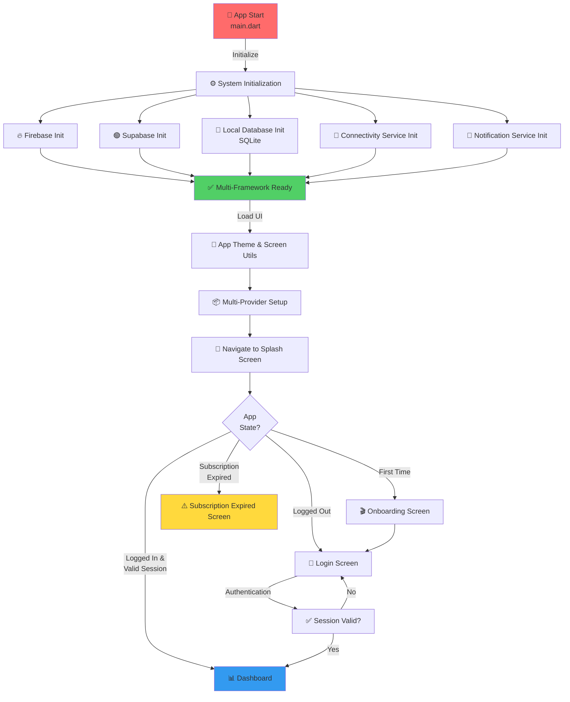

---

## 2. AUTHENTICATION SYSTEM

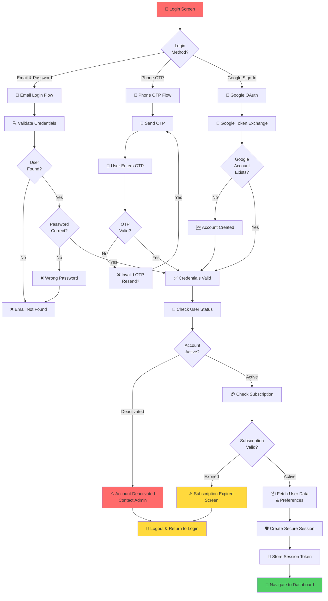

---

## 3. ROLE-BASED ACCESS CONTROL & NAVIGATION

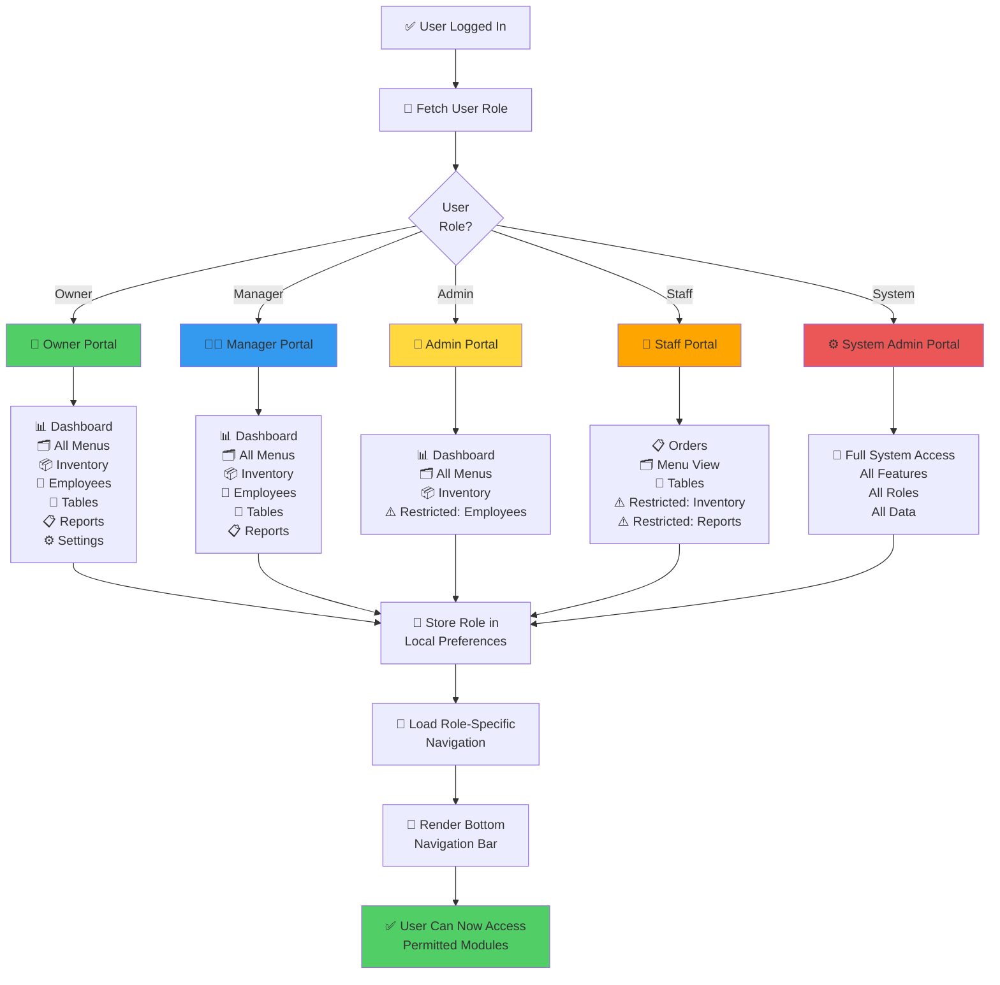

---

## 4. MAIN APPLICATION NAVIGATION STRUCTURE

```mermaid
graph TD
    A["📊 Dashboard<br/>Main Hub"] --> B{Navigation<br/>Selection}
    
    B -->|Tab 1| C["📊 Dashboard/Analytics"]
    B -->|Tab 2| D["📋 Orders Screen"]
    B -->|Tab 3| E["📅 Tables & Reservations"]
    B -->|Tab 4| F["🗂️ Menu Management"]
    B -->|Tab 5| G["📦 Inventory<br/>Role-Gated"]
    
    H["⚙️ Floating Menu"] -->|Settings| I["⚙️ Profile & Settings"]
    H -->|Reports| J["📊 Reports Screen"]
    H -->|Employees| K["👥 Employee Management<br/>Role-Gated"]
    H -->|Suppliers| L["🏭 Supplier Management<br/>Part of Inventory"]
    
    I --> M["👤 Profile Screen<br/>Edit Name/Email<br/>Change Password<br/>Theme Settings<br/>Dark Mode Toggle"]
    
    C --> C1["📈 Revenue Analytics<br/>Weekly/Monthly/Yearly<br/>Top Items<br/>Staff Performance<br/>Table Stats"]
    
    D --> D1["📦 Active Orders"]
    D1 --> D2{Order<br/>Status?}
    D2 -->|Pending| D3["⏳ Pending Orders"]
    D2 -->|Preparing| D4["👨‍🍳 Preparing Orders"]
    D2 -->|Ready| D5["✅ Ready Orders<br/>→ Collect Payment"]
    D2 -->|Completed| D6["💚 Completed Orders"]
    D2 -->|Cancelled| D7["❌ Cancelled Orders"]
    
    D3 --> D8["Add Item Menu<br/>→ Create New Order<br/>Table Selection<br/>Item Selection<br/>Quantity/Options<br/>Special Notes"]
    
    E --> E1["🏢 Floor View<br/>Visual Table Layout<br/>Real-time Status"]
    E --> E2["📅 Calendar View<br/>Upcoming Reservations<br/>Date Selection"]
    E --> E3["📜 History View<br/>Past Reservations"]
    
    E1 --> E4{Action?}
    E4 -->|Seat Guests| E5["👥 Assign Guests to Seats<br/>Generate Session ID<br/>Load Menu"]
    E4 -->|Reserve Table| E6["📅 Make Reservation<br/>Date/Time Selection<br/>Guest Info<br/>Special Requests"]
    E4 -->|View/Edit| E7["👁️ Table Details<br/>Current Status<br/>Guest Info<br/>Session Duration"]
    
    F --> F1["🗂️ Categories<br/>Manage Categories<br/>View/Edit/Delete<br/>Reorder"]
    F --> F2["🍽️ Menu Items<br/>View All Items<br/>Filter by Category<br/>Search Items<br/>Offline Sync Widget"]
    
    F1 --> F3{Admin<br/>Action?}
    F3 -->|Add| F4["➕ Add Category<br/>Name/Description<br/>Color Selection<br/>Upload Image"]
    F3 -->|Edit| F5["✏️ Edit Category<br/>Update Details<br/>Change Image"]
    F3 -->|Delete| F6["🗑️ Delete Category<br/>Confirmation"]
    
    F2 --> F7{Admin<br/>Action?}
    F7 -->|Add| F8["➕ Add Menu Item<br/>Name/Price<br/>Description<br/>Category Selection<br/>Dietary Info<br/>Upload Images<br/>Tags & Allergens"]
    F7 -->|Edit| F9["✏️ Edit Menu Item<br/>Update All Fields<br/>Change Availability"]
    F7 -->|Delete| F10["🗑️ Delete Menu Item<br/>Confirmation"]
    
    G --> G1["📦 Stock View<br/>Items by Status<br/>Stock Levels<br/>Alerts"]
    G1 --> G2{Filter?}
    G2 -->|All| G3["All Inventory Items"]
    G2 -->|In Stock| G4["✅ In Stock Items"]
    G2 -->|Low Stock| G5["⚠️ Low Stock Items"]
    G2 -->|Critical| G6["🔴 Critical Stock"]
    G2 -->|Out of Stock| G7["❌ Out of Stock"]
    
    G3 --> G8{Action?}
    G8 -->|Add| G9["➕ Add Inventory Item<br/>Name/Category<br/>Stock Level<br/>Unit/Cost<br/>Supplier<br/>Reorder Level"]
    G8 -->|Update| G10["🔄 Update Stock<br/>Manual Adjustment<br/>Stock In/Out<br/>Waste Recording"]
    G8 -->|Delete| G11["🗑️ Delete Item<br/>Confirmation"]
    
    L --> L1["🏭 Suppliers Management<br/>View Suppliers<br/>Payment History<br/>Delivery Tracking<br/>Sync with Inventory"]
    
    J --> J1["📊 Reports Dashboard<br/>Customizable Date Range<br/>Multiple Report Types"]
    J1 --> J2{Report<br/>Type?}
    J2 -->|Sales| J3["💰 Sales Report<br/>Daily/Weekly/Monthly<br/>Revenue Analytics<br/>Order Count"]
    J2 -->|Inventory| J4["📦 Inventory Report<br/>Stock Levels<br/>Reorder Analysis<br/>Supplier Summary"]
    J2 -->|Staff| J5["👥 Staff Performance<br/>Orders Per Staff<br/>Revenue per Staff<br/>Efficiency Metrics"]
    J2 -->|Table| J6["📅 Table Analytics<br/>Occupancy Rates<br/>Reservation Summary<br/>Peak Hours"]
    
    K --> K1["👥 Employees List<br/>Add/Edit/Delete<br/>Assign Roles<br/>View Activity<br/>Deactivate Accounts"]
    
    style A fill:#339AF0
    style C fill:#51CF66
    style D fill:#51CF66
    style E fill:#51CF66
    style F fill:#51CF66
    style G fill:#51CF66
    style I fill:#FFD93D
    style J fill:#FFD93D
    style K fill:#FFD93D
```

---

## 5. ORDERS MODULE - DETAILED FLOW

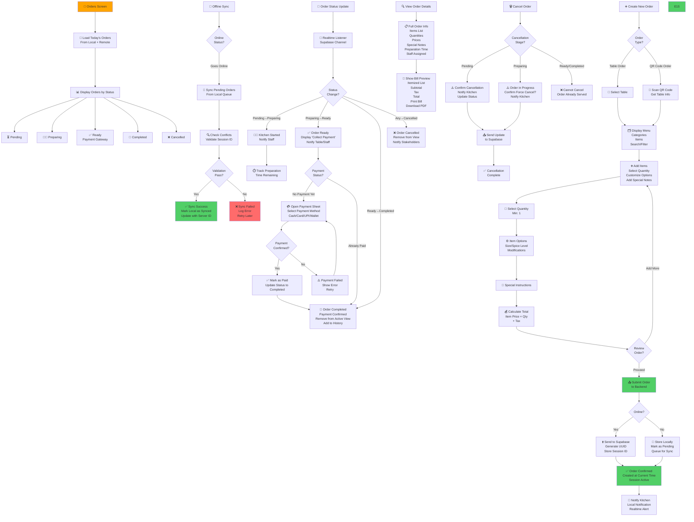

---

## 6. TABLES & RESERVATIONS MODULE - DETAILED FLOW

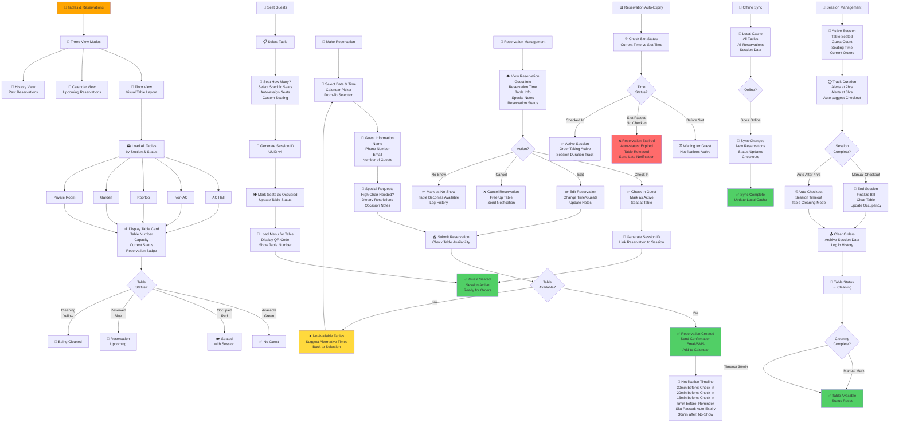

---

## 7. INVENTORY & SUPPLIER MANAGEMENT - DETAILED FLOW

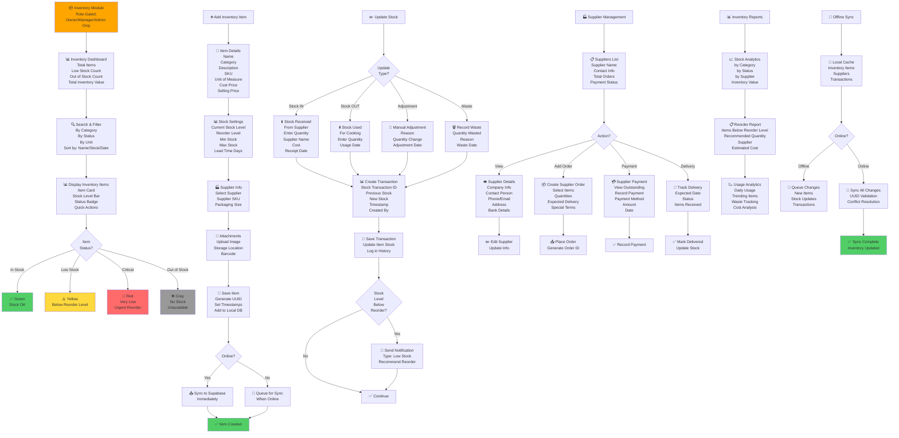

---

## 8. MENU MANAGEMENT - DETAILED FLOW

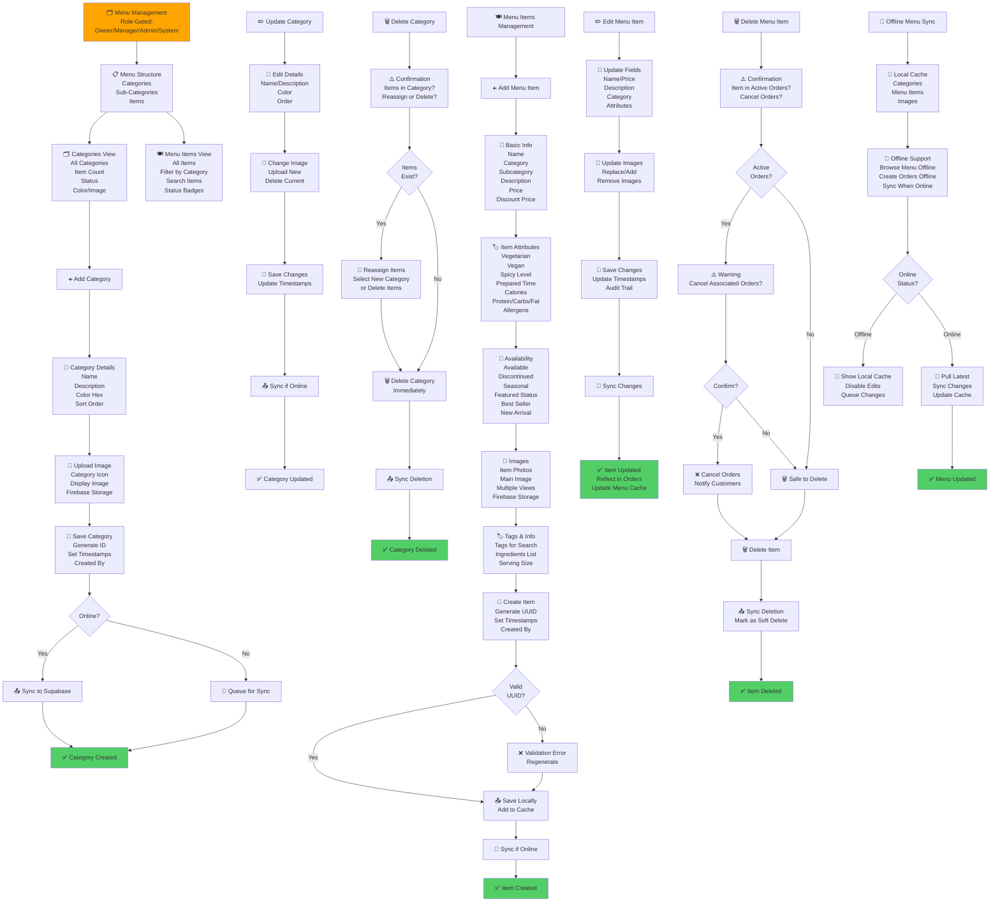

---

## 9. OFFLINE-FIRST ARCHITECTURE & DATA SYNC

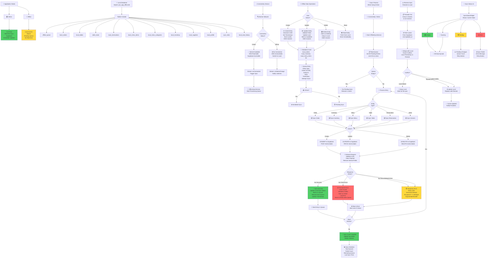

---

## 10. ANALYTICS & REPORTING SYSTEM

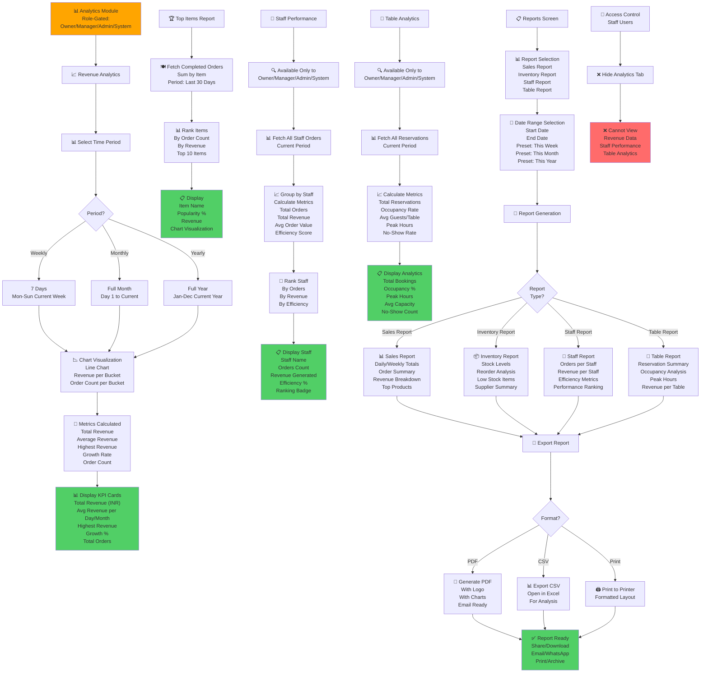

---

## 11. EMPLOYEE MANAGEMENT MODULE

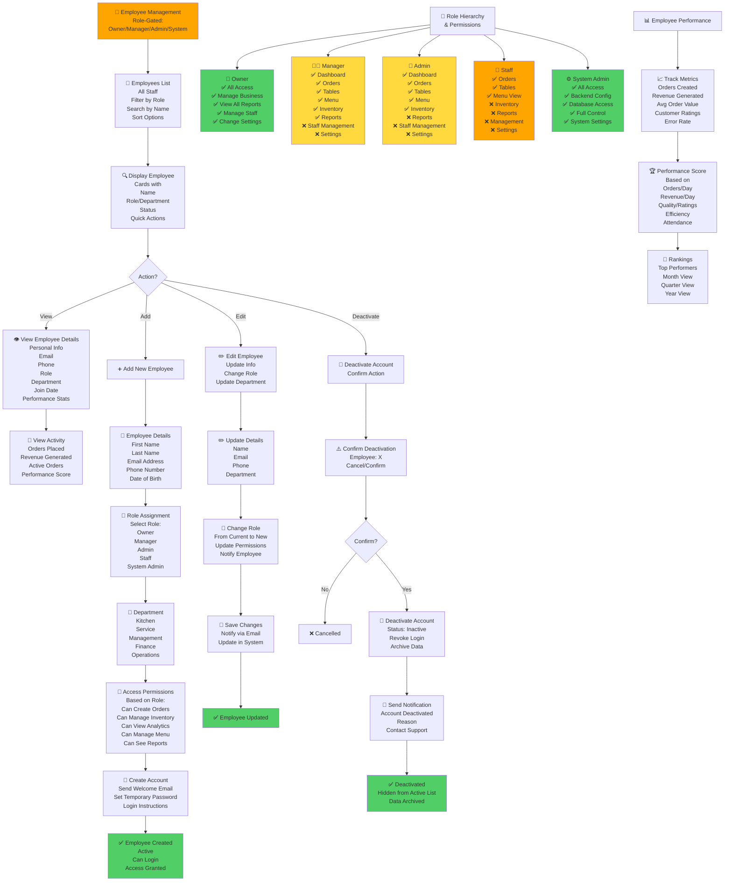

---

## 12. ERROR HANDLING & RECOVERY SYSTEM

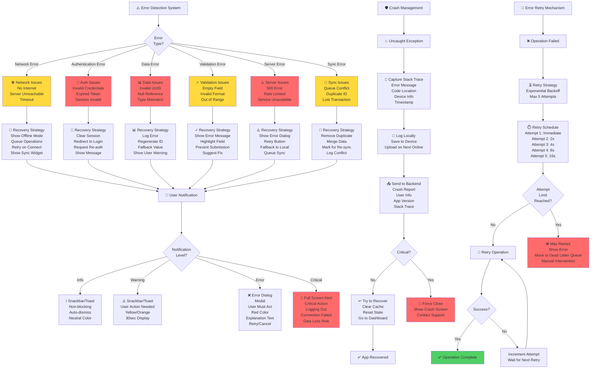

---

## 13. NOTIFICATION SYSTEM

```mermaid
graph TD
    A["🔔 Notification System"] --> B{Notification<br/>Type?}
    
    B -->|Order Notifications| C["📦 Order Events"]
    B -->|Reservation Notifications| D["📅 Reservation Events"]
    B -->|Stock Notifications| E["📦 Stock Events"]
    B -->|System Notifications| F["⚙️ System Events"]
    
    C --> C1["🆕 New Order Created<br/>Kitchen Alerts<br/>Staff Notified"]
    C --> C2["🔄 Order Status Changed<br/>Pending→Preparing<br/>Preparing→Ready<br/>Ready→Completed<br/>Any→Cancelled"]
    C --> C3["💳 Payment Required<br/>Ready Order Waiting<br/>Payment Reminder"]
    
    C1 --> C1A["🔔 Create Notification<br/>Type: NewOrder<br/>Kitchen Display<br/>Alert Sound<br/>Vibration<br/>Badge +1"]
    
    C2 --> C2A["🔔 Create Notification<br/>Type: StatusChange<br/>Status-specific message<br/>Update KDS<br/>Notify Staff"]
    
    C3 --> C3A["🔔 Create Notification<br/>Type: PaymentDue<br/>Ready Order Alert<br/>Persistent Until Paid"]
    
    D --> D1["📅 Reservation Check-in<br/>30min before<br/>20min before<br/>15min before<br/>5min before<br/>Final Reminder"]
    
    D --> D2["📅 No-Show Alert<br/>Slot time passed<br/>Guest not seated<br/>Reservation expires"]
    
    D --> D3["📅 Reservation Cancelled<br/>Booking Cancelled<br/>Table Freed<br/>Guest Notified"]
    
    D1 --> D1A["🔔 Local Notification<br/>Scheduled<br/>Check-in time<br/>Configurable<br/>Repeating"]
    
    D2 --> D2A["🔔 Auto-Expiry Alert<br/>Automatic No-Show<br/>Reservation Expired<br/>Status Updated<br/>History Logged"]
    
    E --> E1["⚠️ Low Stock Alert<br/>Item Below Reorder<br/>Suggest Reorder<br/>Show Supplier"]
    
    E --> E2["🔴 Critical Stock Alert<br/>Item Nearly Empty<br/>Urgent Reorder<br/>Suggest Expedited"]
    
    E --> E3["❌ Out of Stock Alert<br/>Item Unavailable<br/>Mark in Menu<br/>Disable Orders"]
    
    E1 --> E1A["🔔 Create Notification<br/>Type: LowStock<br/>⚠️ Yellow Alert<br/>Action Required"]
    
    E2 --> E2A["🔔 Create Notification<br/>Type: CriticalStock<br/>🔴 Red Alert<br/>Urgent Action"]
    
    E3 --> E3A["🔔 Create Notification<br/>Type: OutOfStock<br/>❌ Gray Alert<br/>Update Menu<br/>Disable Orders"]
    
    F --> F1["🔄 Sync Status<br/>Sync Complete<br/>Sync Failed<br/>Sync Pending"]
    
    F --> F2["🔐 Login Notification<br/>New Device Login<br/>Security Alert<br/>Unusual Activity"]
    
    F --> F3["⚠️ Subscription Alert<br/>Expiring Soon<br/>Expired<br/>Renewal Required"]
    
    G["📱 Notification Delivery"] --> G1{Online<br/>Status?}
    
    G1 -->|Online| G2["📲 Send via<br/>Local Notifications<br/>Flutter Plugin<br/>Device Notification<br/>Sound + Vibration<br/>Heads-up Display"]
    
    G1 -->|Offline| G3["💾 Queue in Local<br/>Firebase Cloud<br/>Deliver When Online<br/>Badge Count"]
    
    G2 --> G4["📍 Notification<br/>Display Integration<br/>Top of Screen<br/>Badge Number<br/>Tap to Open<br/>Auto-dismiss"]
    
    G3 --> G5["🔔 Firebase<br/>Cloud Messaging<br/>Server-side Queue<br/>Reliable Delivery"]
    
    H["🎯 Notification Actions"] --> H1{Notification<br/>Tapped?}
    
    H1 -->|Order Notification| H2["🎯 Navigate to<br/>Orders Screen<br/>Show Order Details<br/>Highlight Order"]
    
    H1 -->|Reservation| H3["🎯 Navigate to<br/>Tables Screen<br/>Show Reservation<br/>Quick Actions"]
    
    H1 -->|Stock Alert| H4["🎯 Navigate to<br/>Inventory Screen<br/>Show Item<br/>Suggest Reorder"]
    
    H1 -->|System Alert| H5["🎯 Navigate to<br/>Relevant Screen<br/>Show Details<br/>Take Action"]
    
    I["⏰ Notification Timeline<br/>For Reservations"] --> I1["Reservation Created<br/>📅 Date/Time Set<br/>🔔 Enable All Alerts"]
    
    I --> I2["30min Before<br/>📬 Check-In Alert<br/>Prepare Table"]
    I --> I3["20min Before<br/>📬 Final Check<br/>Contingency Ready"]
    I --> I4["15min Before<br/>📬 Pre-arrival<br/>Staff Standby"]
    I --> I5["5min Before<br/>📬 Guest Arriving<br/>Final Notice"]
    I --> I6["Slot Time<br/>⏰ Reservation Active<br/>🔔 Seat Alert"]
    I --> I7["15min After Slot<br/>⚠️ Late Notice<br/>Wait or Auto-Expiry?"]
    I --> I8["30min After Slot<br/>🔴 Auto-Expiry<br/>Table Released<br/>Reservation Expired"]
    
    style C1A fill:#FFA500
    style C2A fill:#FFA500
    style C3A fill:#FFD93D
    style D1A fill:#FFD93D
    style D2A fill:#FF6B6B
    style E1A fill:#FFD93D
    style E2A fill:#FF6B6B
    style E3A fill:#FF6B6B
    style G4 fill:#51CF66
    style I8 fill:#FF6B6B
```

---

## 14. STATE MANAGEMENT & PROVIDER ARCHITECTURE

```mermaid
graph TD
    A["🎯 Provider-based<br/>State Management"] --> B["📦 MultiProvider Setup<br/>lib/providers/common_provider.dart"]
    
    B --> C["🔐 Core Services"]
    B --> D["📱 Screen Providers"]
    B --> E["🎨 Theme Provider"]
    
    C --> C1["ConnectivityService<br/>Singleton<br/>Monitors Network<br/>Emits Status Stream"]
    
    D --> D1["SplashProvider<br/>App Initialization<br/>Check Auth State<br/>Route Decision"]
    
    D --> D2["AppAuthenticationProvider<br/>Login/Signup<br/>Session Management<br/>User Data"]
    
    D --> D3["PageSwitcherProvider<br/>Navigation State<br/>Selected Tab Index<br/>Role-based Access<br/>Inventory Gate"]
    
    D --> D4["DashboardProvider<br/>KPI Metrics<br/>Revenue Data<br/>Charts<br/>Staff Performance"]
    
    D --> D5["OrdersProvider<br/>Fetch Orders<br/>Create Orders<br/>Update Status<br/>Payment Processing<br/>Realtime Sync"]
    
    D --> D6["TablesProvider<br/>Table Occupancy<br/>Reservations<br/>Session Management<br/>Calendar Data<br/>History Tracking"]
    
    D --> D7["MenuProvider<br/>Menu Items<br/>Categories<br/>Search/Filter<br/>Local Cache"]
    
    D --> D8["SupabaseMenuProvider<br/>Supabase Menu Sync<br/>Remote Menu Fetch<br/>Realtime Updates"]
    
    D --> D9["InventoryProvider<br/>Stock Management<br/>Item Operations<br/>Notifications<br/>Local Cache"]
    
    D --> D10["QrCodeProvider<br/>QR Generation<br/>Scan Processing<br/>Table Lookup"]
    
    D --> D11["AnalyticsProvider<br/>Revenue Analytics<br/>Charts Data<br/>Period Selection<br/>Role-gated"]
    
    D --> D12["ReportProvider<br/>Report Generation<br/>Date Range<br/>Export Options<br/>PDF/CSV"]
    
    D --> D13["EmployeeManagementProvider<br/>Employee List<br/>Role Assignment<br/>Performance Tracking"]
    
    D --> D14["ProfileProvider<br/>User Profile Data<br/>Settings<br/>Preferences<br/>Password Change"]
    
    D --> D15["CreateAccountProvider<br/>Signup Logic<br/>Phone OTP<br/>Email Verification"]
    
    D --> D16["OnboardingProvider<br/>First-time Setup<br/>Intro Screens"]
    
    D --> D17["NetworkSyncProvider<br/>Offline Sync Status<br/>Queue State<br/>Pending Count"]
    
    E --> E1["ThemeProvider<br/>Dark/Light Mode<br/>Theme Settings<br/>Local Persistence"]
    
    F["🔄 Realtime Listeners<br/>Supabase Channels"] --> F1["OrdersChannel<br/>Listen: orders<br/>Events: INSERT/UPDATE/DELETE<br/>Filters: business_id<br/>Triggers: notifyListeners()"]
    
    F --> F2["TablesChannel<br/>Listen: restaurant_tables<br/>Events: INSERT/UPDATE<br/>Status Changes<br/>Occupancy Updates"]
    
    F --> F3["ReservationsChannel<br/>Listen: table_reservations<br/>Events: INSERT/UPDATE<br/>New Bookings<br/>Cancellations"]
    
    F --> F4["MenuChannel<br/>Listen: menu_items<br/>Events: INSERT/UPDATE/DELETE<br/>Item Changes<br/>Availability Updates"]
    
    G["💾 Local State Caching"] --> G1["📦 Orders Cache<br/>In-memory List<br/>Session-filtered<br/>Auto-refresh"]
    
    G --> G2["📦 Tables Cache<br/>Section-organized<br/>Status-filtered<br/>Real-time updates"]
    
    G --> G3["📦 Menu Cache<br/>Categories + Items<br/>Offline support<br/>Search index"]
    
    G --> G4["📦 Inventory Cache<br/>Stock levels<br/>Filter states<br/>Sync metadata"]
    
    H["🔔 Notification Publishing<br/>Change Updates"] --> H1["Call notifyListeners()"]
    
    H1 --> H2["UI Rebuilds<br/>Consumer Widgets<br/>Watch Selected Data<br/>Triggered by<br/>Build Context"]
    
    H2 --> H3["Rebuild Flow<br/>Provider notified<br/>Consumer listens<br/>Widget rebuilds<br/>State reflected"]
    
    I["⚙️ Provider Lifecycle"] --> I1["Init (in constructor<br/>or initState)<br/>Fetch initial data<br/>Subscribe to realtime<br/>Load from cache"]
    
    I --> I2["Update (on user action<br/>or realtime event)<br/>Modify state<br/>notifyListeners()<br/>Queue sync if needed"]
    
    I --> I3["Dispose (on widget<br/>dispose)<br/>Cancel subscriptions<br/>Close channels<br/>Clear timers"]
    
    style A fill:#339AF0
    style B fill:#339AF0
    style C1 fill:#51CF66
    style F1 fill:#FFA500
    style G1 fill:#FFD93D
    style H3 fill:#51CF66
```

---

## 15. COMPLETE DATA FLOW DIAGRAM

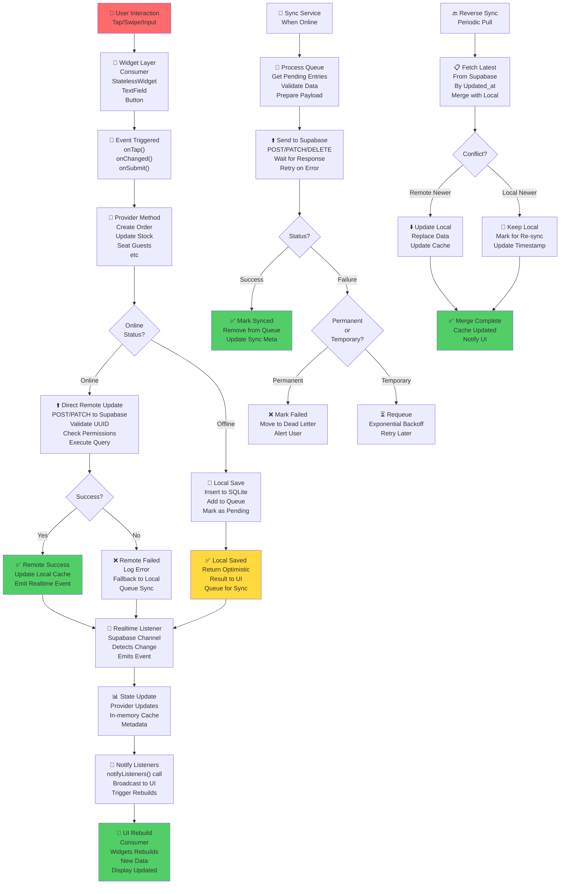

---

## Quick Reference: Module Features & Access

| Module | Owner | Manager | Admin | Staff | System | Role-Gated |
|--------|:-----:|:-------:|:-----:|:-----:|:------:|:----------:|
| **Dashboard** | ✅ | ✅ | ✅ | ❌ | ✅ | Yes |
| **Orders** | ✅ | ✅ | ✅ | ✅ | ✅ | No |
| **Tables/Reservations** | ✅ | ✅ | ✅ | ✅ | ✅ | No |
| **Menu** | ✅ | ✅ | ✅ | 👁️ | ✅ | Yes (Edit) |
| **Inventory** | ✅ | ✅ | ✅ | ❌ | ✅ | Yes |
| **Suppliers** | ✅ | ✅ | ✅ | ❌ | ✅ | Yes |
| **Analytics** | ✅ | ✅ | ✅ | ❌ | ✅ | Yes |
| **Reports** | ✅ | ✅ | ✅ | ❌ | ✅ | Yes |
| **Employees** | ✅ | ✅ | ❌ | ❌ | ✅ | Yes |
| **Settings** | ✅ | ❌ | ❌ | ❌ | ✅ | Yes |

**Legend:** ✅ Full Access | ❌ No Access | 👁️ View Only | ⚙️ Limited

---

## System Integrations & External Services

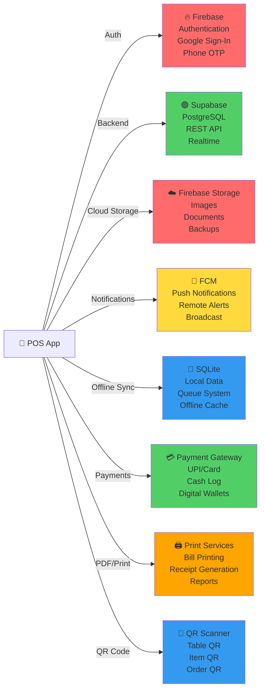

---

## Performance & Optimization Considerations

- **Offline-First Strategy**: All data operations first write to local SQLite, then sync to Supabase
- **Realtime Listeners**: Supabase channels monitor table changes for instant UI updates
- **Provider Caching**: In-memory caches reduce database queries and improve UI responsiveness
- **Pagination**: Large lists (orders, inventory, history) use pagination to reduce memory footprint
- **Image Optimization**: Firebase Storage handles image compression and CDN delivery
- **Session Management**: Table session IDs prevent order bleeding and ensure guest isolation
- **UUID Validation**: All IDs are validated before sync to prevent queue failures
- **Exponential Backoff**: Failed syncs retry with increasing delays to reduce server load
- **Dead Letter Queue**: Failed permanent operations are moved to separate queue for manual review

---

## Development & Deployment Workflow

1. **Local Development**: Use local Firebase emulator and Supabase dev database
2. **Testing**: Run unit/widget tests before commits
3. **CI/CD**: GitHub Actions trigger on pull requests for automated testing
4. **Staging**: Deploy to staging environment for QA testing
5. **Production**: Manual approval required for production deployment
6. **Monitoring**: Error tracking with Sentry, analytics with Firebase Analytics
7. **Rollback Plan**: Keep previous version tagged for quick rollback if needed

---

## Recommended Flowchart Generation & Documentation Tools

### 1. **Mermaid (Current Implementation)**
   - **Why**: Native markdown, version control friendly, no external dependencies
   - **Tools**: [Mermaid.js](https://mermaid.js.org), VS Code Mermaid Preview extension
   - **Usage**: Flowcharts, diagrams, state machines all in markdown

### 2. **Draw.io / Diagrams.net** (Detailed Design)
   - **Why**: Visual editing, professional appearance, export to multiple formats
   - **Usage**: Drag-drop interface design, detailed system architecture diagrams
   - **Export**: PNG, SVG, PDF for presentations

### 3. **Figma** (UI/UX Flows)
   - **Why**: Collaborative design, interactive prototypes, developer handoff
   - **Usage**: App screens, user flows, design system

### 4. **PlantUML** (Technical Documentation)
   - **Why**: Code-driven diagrams, sequence diagrams, component diagrams
   - **Usage**: API interactions, class relationships, deployment diagrams

### 5. **Lucidchart** (Enterprise Documentation)
   - **Why**: Cloud-based, real-time collaboration, extensive template library
   - **Usage**: Process flows, swimlane diagrams, organizational hierarchy

### Automation Scripts

**Generate README from Flowchart:**
```bash
# Use Mermaid CLI
npm install -g @mermaid-js/mermaid-cli
mmdc -i flowchart.md -o flowchart.png
```

**Export to Multiple Formats:**
```bash
# Convert Mermaid to various formats
mermaid --version
mermaid flowchart.md -o output.pdf
mermaid flowchart.md -o output.svg
mermaid flowchart.md -o output.png
```

---

## How to Use This Flowchart

1. **For Developers**: Reference specific sections for implementation details and decision points
2. **For Product Managers**: Use overview diagrams for stakeholder presentations
3. **For QA Teams**: Test scenarios can be derived from error handling and state management flows
4. **For Documentation**: Embed specific diagrams in technical documentation
5. **For Onboarding**: Share with new team members for system architecture understanding
6. **For Investors/Clients**: Use high-level diagrams (sections 1, 3, 4) for demonstrations

---

**Last Updated:** March 26, 2026  
**Version:** 1.0 - Complete  
**Status:** ✅ Production Ready
